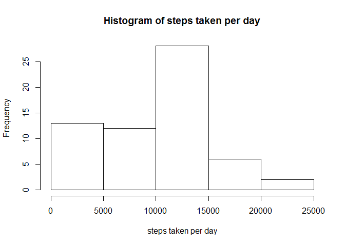
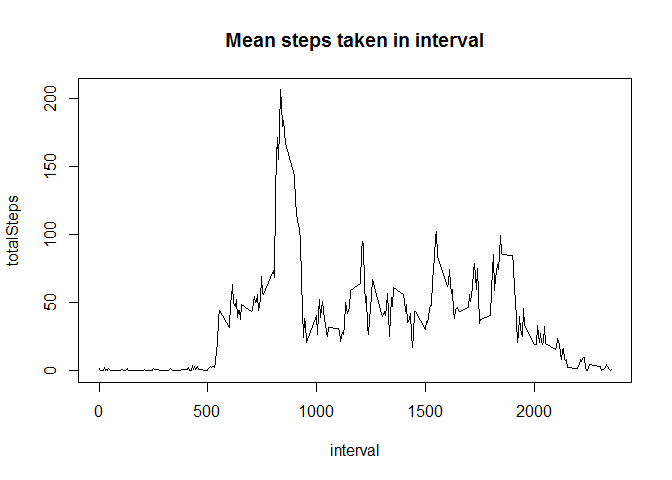
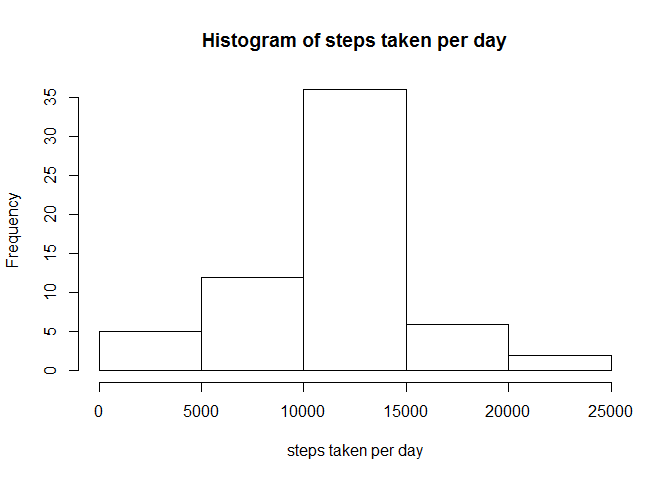
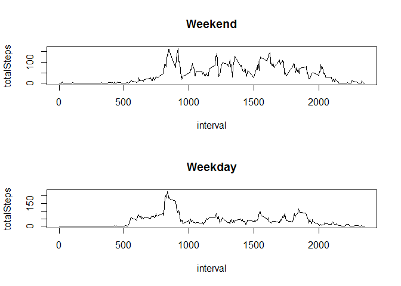

# Reproducible Research: Peer Assessment 1


## Loading and preprocessing the data

```r
library(dplyr)
```

```
## 
## Attaching package: 'dplyr'
## 
## The following object is masked from 'package:stats':
## 
##     filter
## 
## The following objects are masked from 'package:base':
## 
##     intersect, setdiff, setequal, union
```

```r
data <- read.csv(unz("activity.zip","activity.csv"))
dt <- tbl_df(data)
rm("data")
dt$interval2 <- sprintf("%04d", dt[[3]])
dt$timestamp <- with(dt, as.POSIXct(paste(date, interval2),
                                   format="%Y-%m-%d %H%M"))
```
## What is mean total number of steps taken per day?

```r
total.steps <- group_by(dt,date) %>% summarise(totalSteps=sum(steps, na.rm=TRUE))
hist(total.steps[[2]],
     xlab="steps taken per day",
     main="Histogram of steps taken per day")
```

 

Mean and median of steps taken per day:

```r
mean(total.steps[[2]], na.rm=TRUE)
```

```
## [1] 9354.23
```

```r
median(total.steps[[2]], na.rm=TRUE)
```

```
## [1] 10395
```
## What is the average daily activity pattern?

```r
profile <- group_by(dt,interval) %>% summarise(totalSteps=mean(steps, na.rm=TRUE))
plot(profile,
     type="l",
     main="Mean steps taken in interval")
```

 

5 Minute interval with the highest number of steps

```r
filter(profile, totalSteps==max(profile$totalSteps))
```

```
## Source: local data frame [1 x 2]
## 
##   interval totalSteps
## 1      835   206.1698
```
## Imputing missing values
Number of missing values:

```r
sum(is.na(dt$steps))
```

```
## [1] 2304
```
nas are going to be filled with mean for that 5 min interval over the whole time series

```r
dtF <- dt %>%
  group_by(interval) %>%
  mutate(steps= ifelse(is.na(steps), mean(steps, na.rm=TRUE), steps))
```

What is mean total number of steps taken per day in the new data set?


```r
total.steps <- group_by(dtF,date) %>% summarise(totalSteps=sum(steps, na.rm=TRUE))
hist(total.steps[[2]],
     xlab="steps taken per day",
     main="Histogram of steps taken per day")
```

 

As we can see from the histogram above, filling the missing values with averages, has reduced the days with under 5000 steps.
To illustrate the impact on the distribution of steps per day we calculate the mean and median of steps taken per day:

```r
mean(total.steps[[2]], na.rm=TRUE)
```

```
## [1] 10766.19
```

```r
median(total.steps[[2]], na.rm=TRUE)
```

```
## [1] 10766.19
```
The mean and median are now identical while in the original data set the mean was heavily skewed towards lower values.

## Are there differences in activity patterns between weekdays and weekends?
use is.weekend() from the chron library to create column with logical values for weekend/weekday and then separate two new datasets based on this criterion

```r
library(chron)
dtF$weekend <- is.weekend(dtF$timestamp)
weekend <- filter(dtF, weekend)
weekday <- filter(dtF, !weekend)

weekendP <- group_by(weekend,interval) %>% summarise(totalSteps=mean(steps, na.rm=TRUE))
weekdayP <- group_by(weekday,interval) %>% summarise(totalSteps=mean(steps, na.rm=TRUE))
par(mfrow=c(2,1)) 
plot(weekendP,
     type="l",
     main="Weekend")
plot(weekdayP,
     type="l",
     main="Weekday")
```

 


